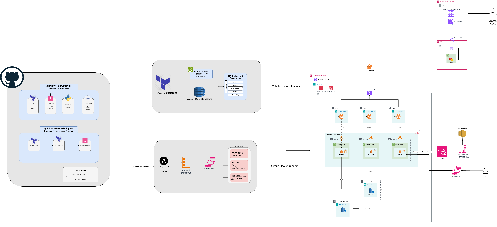

# Neal Street Rewards — Dev Web Tier

A production-shaped dev web tier for the Neal Street digital payments and rewards platform. EC2 instances behind an ALB serve a `/health` endpoint, provisioned with Terraform and configured with Ansible.

## Architecture



```
Internet
   │
   ▼
┌──────────────────────────────────────────┐
│  ALB (public subnet, eu-west-1a)         │
│  - HTTP :80                              │
│  - Health check: GET /health → 200       │
│  - drop_invalid_header_fields = true     │
└──────────────┬───────────────────────────┘
               │
               ▼
┌──────────────────────────────────────────┐
│  EC2 (private subnet, no public IP)      │
│  - Amazon Linux 2023                     │
│  - Nginx :80 → Gunicorn :8000 → Flask   │
│  - SSM Session Manager (no SSH)          │
│  - CloudWatch Agent (logs + metrics)     │
│  - IMDSv2 enforced                       │
└──────────────────────────────────────────┘
               │
               ▼
┌──────────────────────────────────────────┐
│  Supporting Services                     │
│  - Secrets Manager (app secret)          │
│  - CloudWatch Logs (app + system)        │
│  - CloudWatch Alarms (healthy hosts, 5xx)│
│  - S3 + DynamoDB (Terraform state)       │
└──────────────────────────────────────────┘
```

## Prerequisites

| Tool | Version | Install |
|------|---------|---------|
| Terraform | >= 1.14.x | `brew install tfenv && tfenv install latest` |
| Ansible | >= 2.15 | `pip install ansible boto3 botocore` |
| AWS CLI | >= 2.x | `brew install awscli` |
| Python | >= 3.11 | `brew install python@3.11` |
| ansible-lint | >= 6.x | `pip install ansible-lint yamllint` |

AWS credentials must be configured with sufficient permissions:
```bash
export AWS_PROFILE=your-profile
# or
export AWS_ACCESS_KEY_ID=...
export AWS_SECRET_ACCESS_KEY=...
export AWS_DEFAULT_REGION=eu-west-1
```

## Quick Start

### 1. Bootstrap Terraform State Backend

This creates the S3 bucket and DynamoDB table for remote state. Run once per AWS account.

```bash
cd terraform/backend
terraform init
terraform apply
```

### 2. Provision Dev Infrastructure

```bash
cd terraform/environments/dev
terraform init
terraform plan
terraform apply
```

Key outputs:
- `alb_dns_name` — the public URL to hit the health endpoint
- `secret_name` — the Secrets Manager secret name for Ansible
- `app_log_group_name` — CloudWatch log group for the app

### 3. Configure Instances with Ansible

```bash
cd ansible

# Verify dynamic inventory discovers instances
ansible-inventory --graph

# Run all roles (security baseline → app deploy → observability)
ansible-playbook site.yml \
  -e "commit_sha=$(git rev-parse HEAD)" \
  -e "secret_name=$(cd ../terraform/environments/dev && terraform output -raw secret_name)"

# Or run individual roles with tags
ansible-playbook site.yml --tags security    # security baseline only
ansible-playbook site.yml --tags deploy      # app deployment only
ansible-playbook site.yml --tags observability  # CloudWatch agent only
```

### 4. Verify

```bash
# Get the ALB DNS name
ALB_DNS=$(cd terraform/environments/dev && terraform output -raw alb_dns_name)

# Hit the health endpoint
curl http://$ALB_DNS/health
```

Expected response:
```json
{
  "status": "healthy",
  "service": "neal-street-rewards",
  "region": "eu-west-1",
  "commit": "abc123...",
  "uptime_seconds": 42.1,
  "secret": {
    "available": true,
    "keys": ["api_key", "db_host", "db_name", "db_password", "db_port", "db_username"]
  }
}
```

### 5. Access Instances (no SSH)

```bash
# Via SSM Session Manager — requires AWS CLI + session-manager-plugin
aws ssm start-session --target <instance-id> --region eu-west-1
```

## CI/CD

The project includes two GitHub Actions workflows:

| Workflow | Trigger | What it does |
|----------|---------|--------------|
| **CI** (`.github/workflows/ci.yml`) | Push/PR to any branch | Terraform validate, Ansible lint, Python lint, security scan |
| **Deploy** (`.github/workflows/deploy.yml`) | Push to main / manual | Terraform plan → apply → Ansible configure |

### Required GitHub Secrets

| Secret | Description |
|--------|-------------|
| `AWS_DEPLOY_ROLE_ARN` | IAM role ARN for OIDC federation (see SOLUTION.md for setup) |

## Project Structure

```
.
├── .github/workflows/       # CI and deploy pipelines
│   ├── ci.yml               # Validate on every push/PR
│   └── deploy.yml           # Plan → apply → configure on main
├── ansible/
│   ├── ansible.cfg           # Ansible settings, dynamic inventory
│   ├── inventory/
│   │   └── aws_ec2.yml       # Dynamic inventory by EC2 tags
│   ├── site.yml              # Role orchestration playbook
│   └── roles/
│       ├── security_baseline/ # OS hardening (SSH, kernel, auditd)
│       ├── app_deploy/        # Flask + Gunicorn + Nginx
│       └── observability/     # CloudWatch Agent
├── app/
│   ├── app.py                # Flask health endpoint
│   ├── gunicorn.conf.py      # Gunicorn configuration
│   └── requirements.txt      # Pinned Python dependencies
├── terraform/
│   ├── backend/              # S3 + DynamoDB state backend
│   ├── environments/
│   │   └── dev/              # Dev environment composition
│   └── modules/
│       ├── networking/       # VPC, subnets, NAT, flow logs
│       ├── compute/          # EC2, IAM, security groups
│       ├── loadbalancer/     # ALB, target group, listener
│       ├── secrets/          # Secrets Manager
│       └── observability/    # CloudWatch log groups + alarms
├── CHANGELOG.md              # Phase-by-phase change log
├── SOLUTION.md               # Design decisions and trade-offs
└── README.md                 # This file
```

## Cleanup

Tear down all resources to stop incurring costs:

```bash
# 1. Destroy dev infrastructure (in reverse dependency order)
cd terraform/environments/dev
terraform destroy

# 2. Destroy state backend (optional — only if you're done entirely)
cd terraform/backend
# Remove the prevent_destroy lifecycle rule first, then:
terraform destroy

# 3. Verify no resources remain
aws resourcegroupstaggingapi get-resources \
  --tag-filters Key=project,Values=neal-street \
  --region eu-west-1
```

**Cost note:** The primary cost drivers are the NAT Gateway (~$0.045/hr) and the ALB (~$0.0225/hr). Destroy promptly when not in use.

## Tags

All resources are tagged consistently:

| Key | Value | Purpose |
|-----|-------|---------|
| `environment` | `dev` | Environment isolation |
| `service` | `rewards` | Service identification |
| `owner` | `candidate` | Ownership tracking |
| `cost_center` | `payments` | Billing attribution |
| `project` | `neal-street` | Project grouping |
